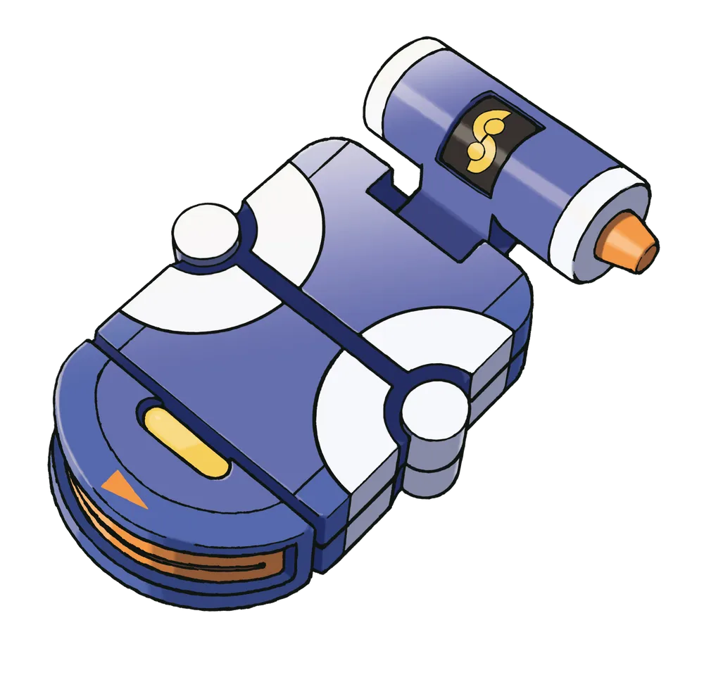

# PokéGere

 
PokéGere is tool for PokéRogue user. Use this tool that memo to game progress. Also provide search for simple data for play

 

# Contributing

## 🛠️ Development

- Nextjs: 14.2.5
- typescript
- vanilla-extract/css
- tanstack/react-query
- zustand

### 💻 Environment Setup

#### Prerequisites

- yarn
- node: 20.16.0
